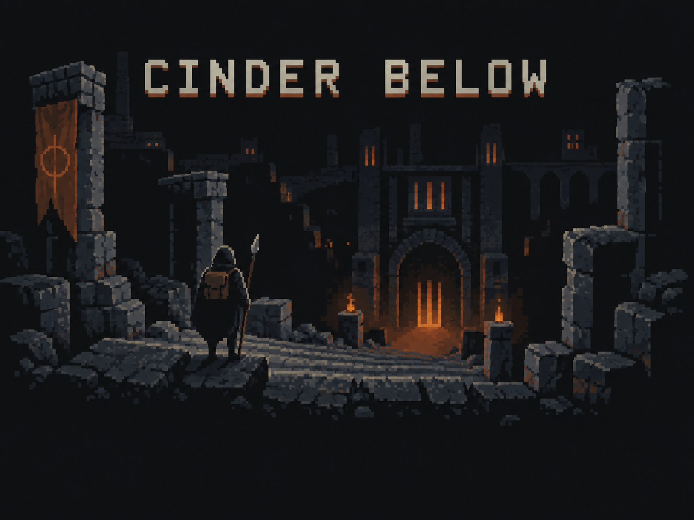
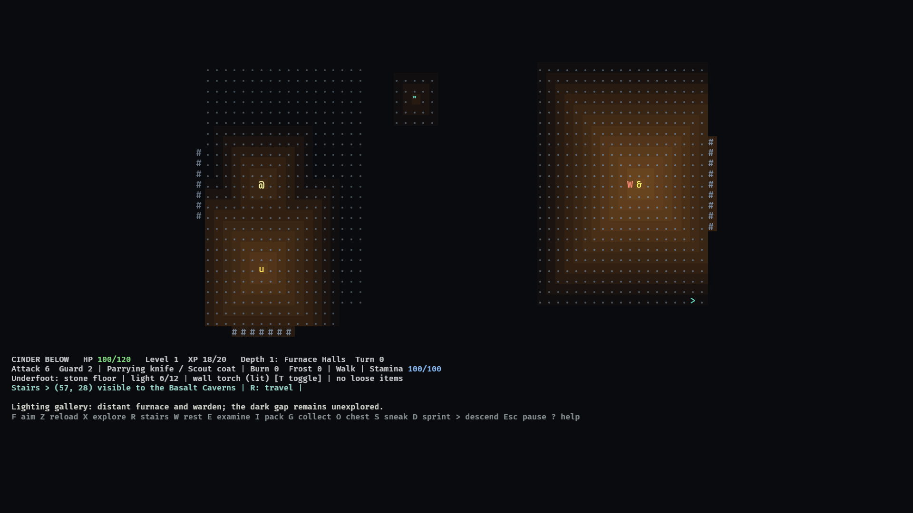
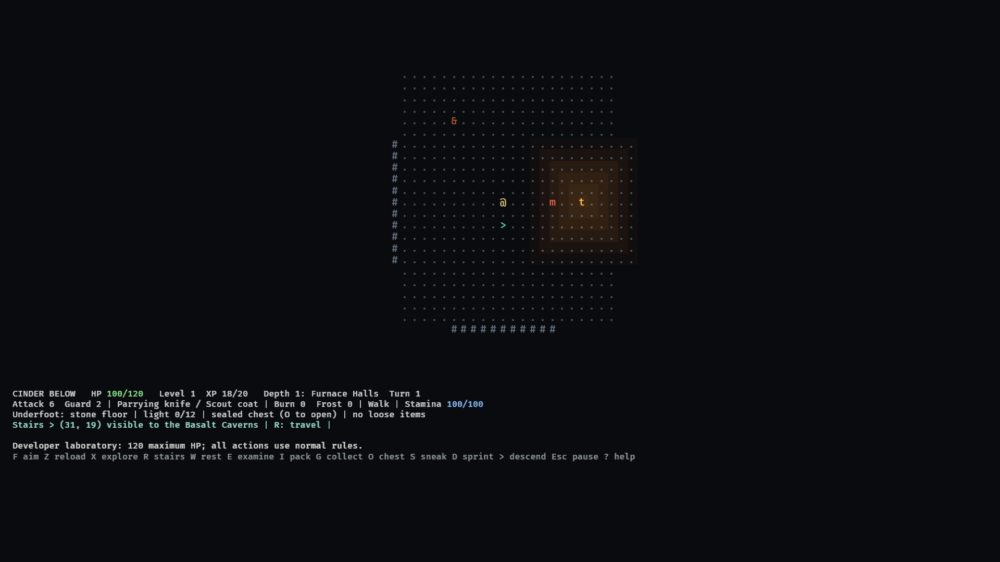

# Cinder Below

  

A turn-based ASCII roguelike through buried furnace cities and cooled lava caves.
Explore procedural dungeons, manage equipment, and descend as far as you can.

## Download for Windows

**[Download the latest portable ZIP](https://github.com/ATabor89/cinder-below-downloads/releases/latest/download/Cinder-Below-win64.zip)**

[Release notes and previous builds](https://github.com/ATabor89/cinder-below-downloads/releases)

Extract the ZIP and run `cinder-below.exe`. No installation or GitHub account is
required. Press F1 for controls. Saves live outside the game folder, so replacing
the executable preserves your current run.

## What it looks like

Light is a shared quantity on the map: fungi, wall torches, braziers and furnaces
each cast a fading glow, and both you and the things that hunt you can see across
it. Darkness hides; light exposes.

  

A kiln moth rests by a torch beside a sealed chest. It cannot see the player
standing in the dark, but light draws it, and so does a thrown flare.

  

Both scenes are captures from the game's automated render check at 1920x1080.

## About this repository

This public repository hosts playable builds and player documentation only.
The game's source repository remains private. GitHub's automatically generated
“Source code” archives contain this downloads repository, not the game; use
**Cinder-Below-win64.zip** to play.

Windows x64 builds are provided for playtesting. Other platforms are not currently
validated. The portable package includes the embedded font's license.
